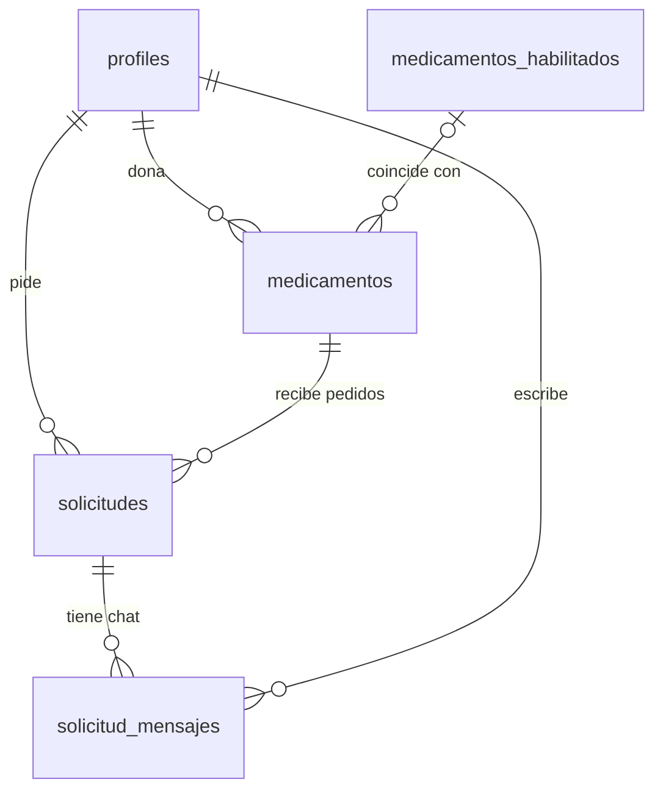

# Base de datos de EcoFARMA

Este documento explica, de forma simple, cómo está armada la base de datos de EcoFARMA y cómo se protege la información de los usuarios.

---

## 1. ¿Dónde se guardan los datos?

EcoFARMA usa **Supabase**, un servicio que ofrece una base de datos **PostgreSQL** junto con otras herramientas:

- **Auth:** registro e inicio de sesión de usuarios.
- **Storage:** almacenamiento de archivos (fotos de envases y recetas).
- **Realtime:** mensajes en tiempo real (el chat).
- **Edge Functions:** pequeños programas que corren en el servidor para tareas delicadas.

La aplicación web (el **frontend**, hecho con Vue) se conecta directamente a Supabase. Por eso la seguridad no depende del frontend: la base de datos misma decide quién puede ver o modificar cada dato.

---

## 2. Las tablas

Una **tabla** es como una planilla de cálculo: cada **fila** es un registro (por ejemplo, un medicamento) y cada **columna** es un dato de ese registro (nombre, vencimiento, etc.).

EcoFARMA tiene 5 tablas:

| Tabla | ¿Qué guarda? |
|---|---|
| `profiles` | Los datos de cada usuario |
| `medicamentos_habilitados` | El listado oficial de medicamentos permitidos (vademécum) |
| `medicamentos` | Los medicamentos que donan los usuarios |
| `solicitudes` | Los pedidos de un usuario para recibir un medicamento |
| `solicitud_mensajes` | Los mensajes del chat de cada solicitud |

### Cómo se relacionan



En palabras:

- Un **usuario** puede donar muchos **medicamentos**.
- Un **usuario** puede hacer muchas **solicitudes**.
- Cada **medicamento** donado puede coincidir con un medicamento del **vademécum**.
- Cada **solicitud** pide un **medicamento** y tiene su propio **chat**.

### 2.1 `profiles` — Usuarios

El email y la contraseña los guarda Supabase Auth en una tabla interna (`auth.users`). En `profiles` se guarda el resto de los datos de la persona.

| Columna | Significado |
|---|---|
| `id` | Identificador del usuario (el mismo que usa Supabase Auth) |
| `name` | Nombre |
| `dni` | DNI (no se puede repetir) |
| `telefono`, `direccion`, `localidad` | Datos de contacto |
| `rol` | `user` (usuario común) o `admin` (administrador) |
| `is_validado` | Si la cuenta está habilitada. Arranca en `true`; el admin la pone en `false` para suspenderla |
| `acepto_ddjj` | Si aceptó la Declaración Jurada (DDJJ) |
| `fecha_aceptacion_ddjj` | Cuándo la aceptó |

**Dato importante:** el perfil se crea solo. Cuando alguien se registra, un **trigger** (una acción automática de la base de datos) crea su fila en `profiles` con los datos del formulario. El rol siempre arranca como `user`: nadie puede registrarse como administrador.

### 2.2 `medicamentos_habilitados` — Vademécum

Es el listado oficial de medicamentos esenciales del **Programa Remediar**. Sirve para comprobar si un medicamento donado está permitido.

| Columna | Significado |
|---|---|
| `principio_activo` | La droga (por ejemplo, ibuprofeno) |
| `concentracion` | Cantidad de droga (por ejemplo, 400 mg) |
| `forma_farmaceutica` | Comprimido, jarabe, etc. |
| `nombre_comercial` | Marca (opcional, porque Remediar usa nombres genéricos) |
| `presentacion` | Por ejemplo, caja x 20 comprimidos |
| `requiere_receta` | `true` en antibióticos y psicofármacos |

### 2.3 `medicamentos` — Donaciones

Cada fila es un medicamento que un usuario publicó para donar.

| Columna | Significado |
|---|---|
| `user_id` | Quién lo donó |
| `medicamento_habilitado_id` | Con qué medicamento del vademécum coincidió (vacío si no coincidió) |
| `nombre_comercial`, `principio_activo`, `concentracion`, `forma_farmaceutica` | Datos del medicamento |
| `cantidad_disponible` | Cuántas unidades hay (no puede ser negativa) |
| `lote` | Número de lote del envase |
| `fecha_vencimiento` | Fecha de vencimiento |
| `fotos_envase` | Hasta 3 fotos del envase |
| `descripcion` | Comentario opcional |
| `estado` | En qué situación está la donación (ver abajo) |
| `motivo_rechazo` | Por qué el admin la rechazó, si corresponde |

Estados posibles de un medicamento:

- `disponible`: se ve en el catálogo.
- `pendiente_revision`: no coincidió con el vademécum y espera que un admin lo revise.
- `reservado`: alguien lo solicitó.
- `entregado`: ya se entregó.
- `rechazado`: el admin no lo aprobó.

### 2.4 `solicitudes` — Pedidos

Cada fila es el pedido de un usuario (el **receptor**) para recibir un medicamento.

| Columna | Significado |
|---|---|
| `medicamento_id` | Qué medicamento pide |
| `receptor_id` | Quién lo pide |
| `es_para_tercero` | Si lo pide para otra persona |
| `nombre_destinatario_final` | Nombre de esa otra persona (obligatorio si es para un tercero) |
| `receta_medica_url` | Foto de la receta, si hace falta |
| `codigo_confirmacion` | Código de 6 dígitos para confirmar la entrega en persona |
| `acepto_ddjj_receptor` | Si el receptor aceptó la Declaración Jurada |
| `estado` | En qué situación está el pedido (ver abajo) |
| `fecha_entrega` | Cuándo se entregó |

Estados posibles de una solicitud:

- `pendiente_coordinacion`: donante y receptor están acordando el encuentro por chat.
- `en_camino`: ya acordaron y se va a hacer la entrega.
- `completado`: el medicamento se entregó.
- `cancelado`: el pedido se canceló.

**¿Cómo funciona el código de 6 dígitos?** Solo el receptor lo ve. Cuando se encuentran, el receptor se lo dice al donante, y el donante lo ingresa en la app para confirmar la entrega. Así se comprueba que el medicamento llegó a la persona correcta.

### 2.5 `solicitud_mensajes` — Chat

Cada fila es un mensaje del chat de una solicitud. Solo participan el donante y el receptor.

| Columna | Significado |
|---|---|
| `solicitud_id` | A qué solicitud pertenece |
| `user_id` | Quién escribió el mensaje |
| `mensaje` | El texto (no puede estar vacío) |
| `created_at` | Cuándo se envió |

### Columnas que tienen todas las tablas

- `id`: identificador único de cada fila.
- `created_at`: fecha en que se creó la fila.
- `updated_at`: fecha de la última modificación (se actualiza sola). El chat no la tiene porque los mensajes no se editan.

---

## 3. Seguridad: dos "candados"

Como el frontend se conecta directo a la base de datos, hace falta que la base controle quién puede hacer qué. PostgreSQL usa **dos candados**, y para acceder a un dato hay que pasar los dos:

1. **Permisos de tabla (GRANT):** ¿esta persona puede usar esta tabla? ¿Para leer, para escribir o para nada?
2. **Políticas RLS:** de esta tabla, ¿qué filas puede ver o modificar?

Un ejemplo para entenderlo: el **GRANT** es la llave de la puerta de un edificio, y las **políticas RLS** deciden a qué departamentos podés entrar una vez adentro. Si no tenés la llave del edificio, no importa qué departamentos tengas permitidos: no entrás.

### Los tipos de usuario de la base de datos (roles)

Supabase identifica a quien hace cada consulta con un **rol**:

| Rol | ¿Quién es? |
|---|---|
| `anon` | Un visitante que no inició sesión |
| `authenticated` | Un usuario que inició sesión |
| `service_role` | El servidor (las Edge Functions). Ignora las políticas RLS, por eso nunca se usa desde el frontend |

---

## 4. Primer candado: permisos de tabla (GRANT)

`GRANT` es la instrucción de PostgreSQL que da permisos. Por ejemplo:

```sql
grant select on public.medicamentos to anon, authenticated;
```

Significa: "los visitantes y los usuarios logueados pueden **leer** (`select`) la tabla `medicamentos`".

Las operaciones posibles son:

- `select`: leer.
- `insert`: crear filas nuevas.
- `update`: modificar filas.
- `delete`: borrar filas.

En muchos proyectos de Supabase estos permisos se dan automáticamente. **En EcoFARMA no**, así que se dan a mano, tabla por tabla. Eso es lo que hace la migración `table_grants`.

### Permisos que tiene cada rol

| Tabla | Visitante (`anon`) | Usuario logueado (`authenticated`) |
|---|---|---|
| `profiles` | Nada | Leer. Modificar solo `telefono`, `direccion` y `localidad` |
| `medicamentos_habilitados` | Leer | Leer |
| `medicamentos` | Leer | Leer |
| `solicitudes` | Nada | Leer todas las columnas **menos** `codigo_confirmacion` |
| `solicitud_mensajes` | Nada | Leer y enviar mensajes |

El servidor (`service_role`) tiene permiso para todo en todas las tablas, porque lo usan las Edge Functions.

### Permisos por columna

Algunos permisos no se dan sobre la tabla entera sino sobre **columnas puntuales**:

- En `profiles`, el usuario solo puede modificar `telefono`, `direccion` y `localidad`. No puede cambiar su `rol` (para hacerse admin), su `dni` ni `is_validado` (para quitarse una suspensión).
- En `solicitudes`, el usuario no puede leer `codigo_confirmacion`. Si pudiera, el donante vería el código y confirmaría la entrega sin haber visto al receptor. El receptor lo obtiene con una función especial (ver sección 6).

---

## 5. Segundo candado: políticas RLS

**RLS** significa *Row Level Security* (seguridad a nivel de fila). Una vez que el rol pasó el primer candado, las políticas RLS deciden **qué filas** puede ver o modificar.

Todas las tablas tienen RLS activado. Si una tabla tiene RLS activado y no hay ninguna política para una operación, esa operación queda **bloqueada**: no se devuelve ni se modifica ninguna fila.

### Políticas de cada tabla

**`profiles`**

- Cada usuario ve **su propio perfil**. El admin ve todos.
- Cada usuario puede editar **solo su propio perfil** (y solo las columnas permitidas).

**`medicamentos_habilitados`**

- Cualquiera puede ver el vademécum, aunque no haya iniciado sesión.

**`medicamentos`**

- Cualquiera puede ver los medicamentos **disponibles y no vencidos** (el catálogo público).
- El donante ve **todas sus donaciones**, en cualquier estado.
- El receptor ve los medicamentos **que solicitó**, aunque ya no estén disponibles.
- El admin ve **todos**.

**`solicitudes`**

- La ven solo **los dos participantes** (donante y receptor) y el admin.

**`solicitud_mensajes`**

- Los mensajes los leen solo **los dos participantes** de la solicitud.
- Para enviar un mensaje hay que cumplir todo esto:
  - ser participante de la solicitud;
  - enviarlo con tu propio usuario (no se puede escribir en nombre de otro);
  - tener la cuenta habilitada (`is_validado = true`);
  - que la solicitud siga activa (`pendiente_coordinacion` o `en_camino`).

---

## 6. Funciones auxiliares

Algunas comprobaciones se repiten en varias políticas, así que se guardaron como **funciones** dentro de la base de datos:

| Función | ¿Qué responde? |
|---|---|
| `es_admin()` | ¿El usuario actual es administrador? |
| `es_participante(solicitud)` | ¿El usuario actual es el donante o el receptor de esa solicitud? |
| `solicito_medicamento(medicamento)` | ¿El usuario actual pidió ese medicamento? |

Y dos funciones que el frontend puede llamar directamente:

| Función | ¿Para qué sirve? |
|---|---|
| `participantes_solicitud(solicitud)` | Devuelve solo el **nombre** del donante y del receptor. Así cada uno sabe con quién habla, sin ver el DNI, teléfono ni dirección del otro |
| `obtener_codigo_confirmacion(solicitud)` | Devuelve el código de 6 dígitos, **solo si quien pregunta es el receptor** |

Estas funciones son *security definer*: se ejecutan con permisos elevados para poder consultar las tablas sin chocar con las propias políticas, pero cada una controla adentro quién está preguntando.

---

## 7. ¿Qué puede cambiar el frontend y qué no?

El frontend puede **leer** casi todo lo que le corresponde a cada usuario, pero **modifica muy poco** por su cuenta:

| Acción | ¿Quién la hace? |
|---|---|
| Editar teléfono, dirección y localidad del perfil | El frontend, directo a la base |
| Enviar mensajes en el chat | El frontend, directo a la base |
| Publicar un medicamento | Edge Function `publicar-medicamento` |
| Crear una solicitud | Edge Function `crear-solicitud` |
| Confirmar una entrega con el código | Edge Function `confirmar-entrega` |
| Aprobar o rechazar donaciones, suspender usuarios | Edge Functions de administración |

**¿Por qué las acciones importantes van por Edge Functions?** Porque tienen reglas que no se pueden dejar en manos del navegador del usuario. Por ejemplo, al crear una solicitud hay que comprobar si el medicamento requiere receta, generar el código de 6 dígitos y reservar el medicamento. Si eso lo hiciera el frontend, un usuario con conocimientos técnicos podría saltearse los controles. En cambio, la Edge Function corre en el servidor y nadie puede modificarla.

Por eso, por ejemplo, la tabla `solicitudes` **no tiene ninguna política para crear filas**: desde el frontend es imposible insertar una solicitud directamente.

---

## 8. Migraciones

Los cambios en la base de datos se escriben en archivos SQL llamados **migraciones**, guardados en `supabase/migrations/`. Cada archivo se aplica una sola vez y en orden, así cualquier copia de la base queda igual.

| Migración | ¿Qué hace? |
|---|---|
| `create_profiles` | Crea la tabla de usuarios y el trigger que crea el perfil al registrarse |
| `create_medicamentos_habilitados` | Crea el vademécum |
| `create_medicamentos` | Crea la tabla de donaciones |
| `create_solicitudes` | Crea la tabla de pedidos |
| `create_solicitud_mensajes` | Crea la tabla del chat |
| `rls_policies` | Crea las funciones auxiliares, las políticas RLS y los permisos por columna |
| `table_grants` | Da los permisos de tabla a los roles (primer candado) |

---

## Glosario

- **Base de datos:** lugar donde se guarda la información de forma ordenada.
- **Tabla:** conjunto de datos del mismo tipo, organizado en filas y columnas.
- **Fila (registro):** un elemento de la tabla, por ejemplo un medicamento.
- **Columna (campo):** un dato de cada fila, por ejemplo la fecha de vencimiento.
- **Clave primaria (`id`):** valor único que identifica cada fila.
- **Clave foránea:** columna que apunta a una fila de otra tabla, por ejemplo `user_id` apunta a un usuario.
- **Trigger:** acción que la base de datos ejecuta sola cuando pasa algo (por ejemplo, cuando alguien se registra).
- **Rol:** identidad con la que se conecta alguien a la base de datos.
- **GRANT:** instrucción que da permisos sobre una tabla.
- **RLS:** reglas que deciden qué filas puede ver o modificar cada usuario.
- **Edge Function:** programa que corre en el servidor para hacer tareas que no deben quedar en el navegador.
- **Migración:** archivo con los cambios a aplicar en la estructura de la base de datos.
- **Frontend:** la parte de la aplicación que el usuario ve y usa en el navegador.
